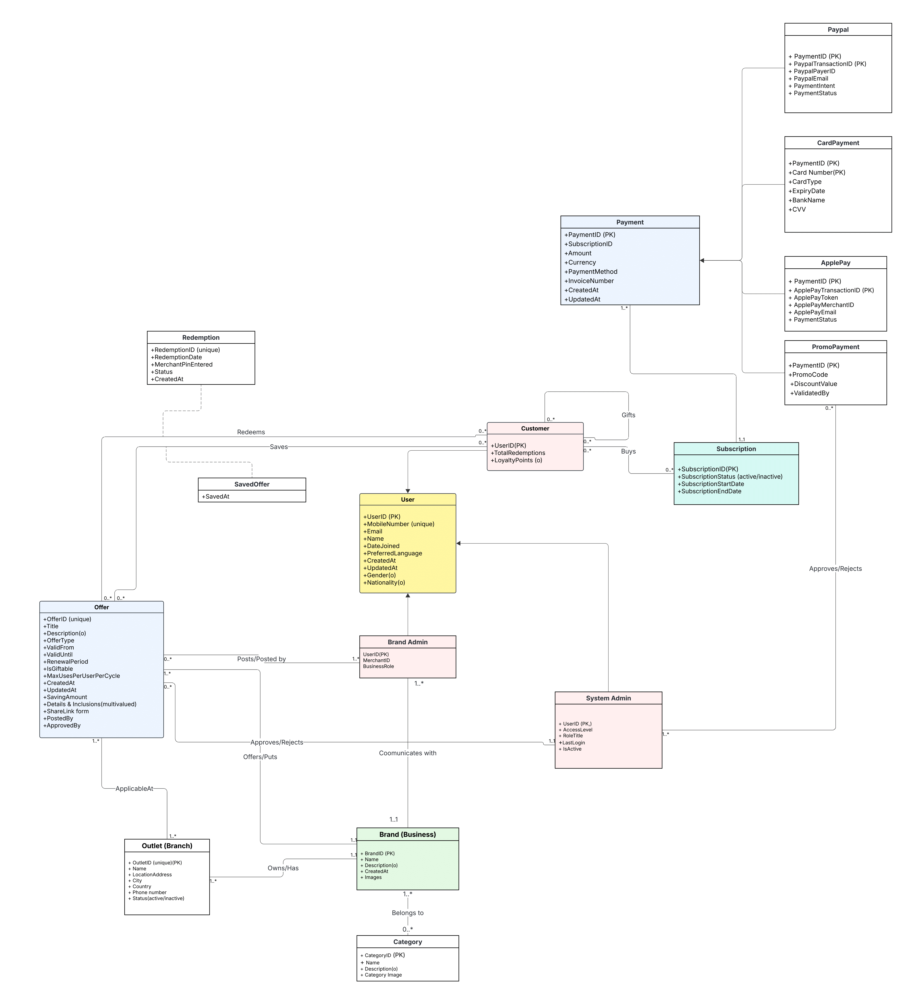
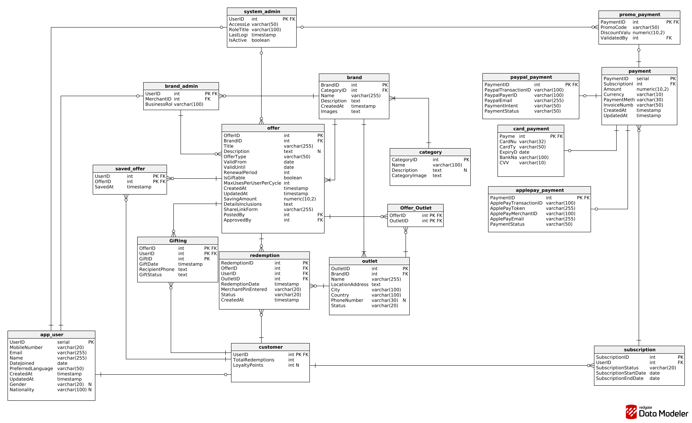

# UrbanPoint Database System
## README / Execution Guide
## UML Conceptual Model


## Physical Database Model


This document provides instructions for creating, initializing, and interacting with the **UrbanPoint PostgreSQL database**, as well as running the Python programs that implement different user stories. It serves as a standalone execution guide for testing and demonstrating the system.

---

## 1. Database Setup

Before running any queries or Python scripts, the UrbanPoint database must be created and populated using the provided SQL files:

* **create.sql** — creates all tables, keys, and constraints.
* **initialize.sql** — inserts sample and reference data.
* **show_all.sql** — displays the content of all major tables.

### Connection Parameters
All commands assume the following PostgreSQL environment:
* **Username:** `isdb`
* **Database:** `urbanpoint`

### Step 1: Create the Schema
Run the following to create all relations, primary keys, foreign keys, and constraints:
```bash
psql -U isdb -d urbanpoint -f create.sql
```

### Step 2: Insert Initial Data

Run the following to load sample customers, brands, outlets, offers, and payments:
```bash
psql -U isdb -d urbanpoint -f initialize.sql
```

### Step 3: View Current Database State (Optional)

This script prints all tables to help verify initialization:
```bash
psql -U isdb -d urbanpoint -f show_all.sql
```

## Running Python Programs
Several Python scripts are provided to demonstrate how user stories are implemented.
* **menu.py** — an interactive menu to explore all functionalities.
* **first-user-story.py, ...** — individual scripts for testing each story.
Make sure you are in the same directory as the Python files.
#### Option A: Run the Interactive Menu
Use:
```bash
python3 menu.py
```

This shows a numbered interface where you can select operations such as:
* creating a customer account
* browsing brands
* searching for outlets
* running analytical reports
* generating contact lists
Each option internally calls the relevant SQL function or query.

#### Option B: Run a Specific User Story Script
To test a user story individually:
```bash 
python3 first-user-story.py
```
Each user story file contains:
* example inputs
* example function calls
* SQL execution from Python

These test calls can be removed once validated, since menu.py exposes all functionalities
in one place.
## Verifying Results
After performing any operation, use:
```bash
psql -U isdb -d urbanpoint -f show_all.sql
```
This allows you to confirm:
* new customers were inserted
* new outlets or offers appear correctly
* redemptions and payments were recorded
* analytical queries updated or displayed the expected results

## Quick Execution Summary
```bash
# Create database schema
psql -U isdb -d urbanpoint -f create.sql
# Insert sample data
psql -U isdb -d urbanpoint -f initialize.sql
# View tables (optional)
psql -U isdb -d urbanpoint -f show_all.sql
# Run the interactive menu
python3 menu.py
# Run a specific user story
python3 first-user-story.py
```
